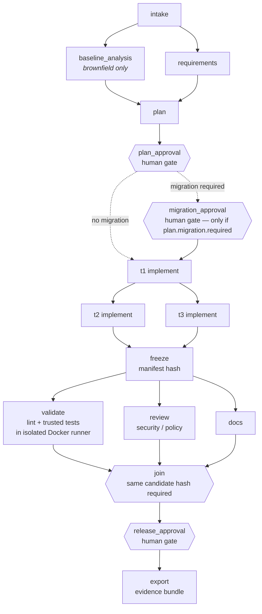
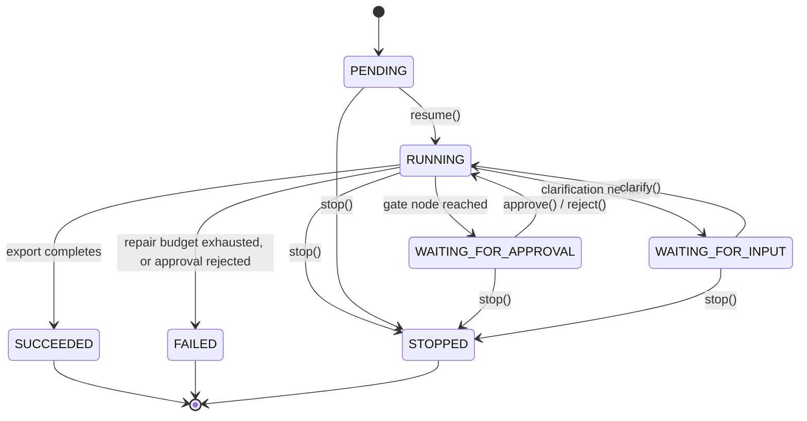
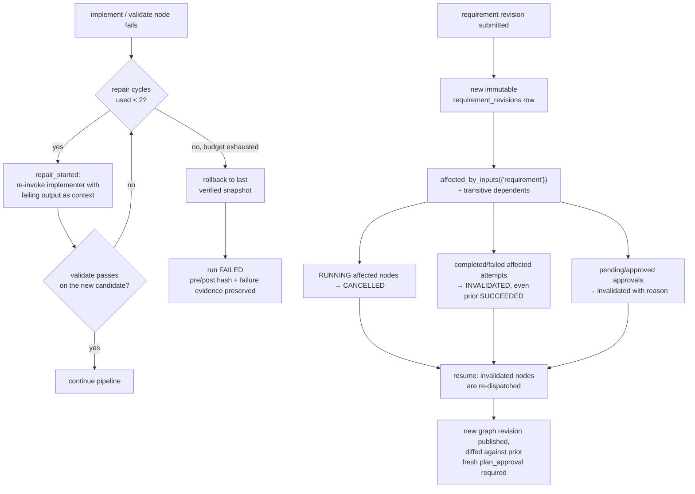

# ForgeFlow

A local, reviewable agentic software-engineering workbench. Its runtime agents generate and evolve a URL
shortener through an explicit dependency graph with durable state, human approval gates, real isolated
tool execution, bounded recovery, and dynamic replanning. See [`docs/architecture.md`](docs/architecture.md)
for the design and [`docs/limitations.md`](docs/limitations.md) for what this prototype does not claim —
**read that file's "Two unresolved architectural gaps" section first**; two real, adversarially-found
issues (evaluator process isolation, lease-ownership atomicity) remain open by explicit decision, not
oversight.

**Start here for a submission review:** [`SUBMISSION.md`](SUBMISSION.md) maps every deliverable the
assignment requires to its doc. [`docs/final-engineering-summary.md`](docs/final-engineering-summary.md)
is the accurate, current-state summary.

## Architecture at a glance

Full breakdown (components, state model, policy engine, adapters, isolated runner): see
[`docs/architecture.md`](docs/architecture.md) — including
[why this is a standalone coordinator and not a skill on top of Claude Code/Codex/Cursor](docs/architecture.md#why-a-standalone-coordinator-not-a-skill-on-top-of-claude-code--codex--cursor).

### Orchestration graph

Gates (diamond nodes) are inserted by the coordinator, not proposed by the model — a plan cannot omit
them. `migration_approval` only exists on the branch when the plan itself declares a migration.
Implementation tasks (`t1..tN`) are whatever DAG the *approved* plan defines; two independent tasks are
shown running in parallel here because that is what the scheduler actually does when their dependencies
allow it.



### Run lifecycle



### Failure recovery and replanning decision flow

Two independent decision paths: bounded repair on a failed node (left), and invalidation cascade on a
mid-flight requirement revision (right, `Coordinator._revise`).



## Prerequisites

- Python 3.13 and [`uv`](https://docs.astral.sh/uv/) (or plain `pip`).
- Docker Desktop or another local Docker daemon, running (`docker version`) — generated code only ever
  executes inside the isolated worker container; without Docker that execution is refused, not
  downgraded.
- For live mode: an OpenAI API key with access to the configured model.

## Setup

```bash
uv venv .venv --python 3.13
uv pip install -e ".[dev]"
docker build -t forgeflow-worker:latest -f docker/Dockerfile.worker docker/
```

## Configuration

Copy `.env.example` to `.env` and fill in real values; `.env` is git-ignored and is never read by the
worker container (`coordinator/policy.py::worker_env` refuses to pass any credential-shaped variable
through, and asserts no `OPENAI*` variable reaches the container environment).

| Variable | Meaning | Default |
|---|---|---|
| `FORGEFLOW_MODE` | `fixture` or `live` | `fixture` |
| `OPENAI_API_KEY` | required when `FORGEFLOW_MODE=live` | — |
| `OPENAI_MODEL` | required when `FORGEFLOW_MODE=live` | — |
| `FORGEFLOW_DB` | SQLite path | `forgeflow.db` |
| `FORGEFLOW_RUNS_DIR` | per-run workspace/evidence root | `runs/` |
| `FORGEFLOW_HOST` / `FORGEFLOW_PORT` | UI bind address | `127.0.0.1:8000` |
| `FORGEFLOW_HUMAN` | local approver label recorded on decisions | `owner` |

## Running the coordinator

CLI (used for every scenario rehearsal below):

```bash
.venv/bin/python -m coordinator.cli scenarios
.venv/bin/python -m coordinator.cli create A_greenfield
.venv/bin/python -m coordinator.cli resume <run-id>
.venv/bin/python -m coordinator.cli status <run-id>
.venv/bin/python -m coordinator.cli approve <run-id> <approval-id>
.venv/bin/python -m coordinator.cli clarify <run-id> <clarification-id> --answers '[{"id":"Q1","answer":"..."}]'
.venv/bin/python -m coordinator.cli revise <run-id> --text "..." --reason "..."
.venv/bin/python -m coordinator.cli stop <run-id> --reason "..."
.venv/bin/python -m coordinator.cli export <run-id>
.venv/bin/python -m coordinator.cli metrics
```

Minimal UI (server-rendered, polls every 4s, loopback-only):

```bash
.venv/bin/python -m coordinator.cli serve
# open http://127.0.0.1:8000
```

## Offline (fixture) rehearsal

```bash
export FORGEFLOW_MODE=fixture
.venv/bin/python -m coordinator.cli create A_greenfield
# ... resume/approve as printed ...
```

Every fixture-mode run is labeled `execution_mode: fixture` throughout the UI, events, and exported
bundle. Fixture data lives under `fixtures/` and is deterministic, hand-authored reference material — see
[`fixtures/README.md`](fixtures/README.md).

## Live rehearsal

```bash
export FORGEFLOW_MODE=live
export OPENAI_API_KEY=sk-...
export OPENAI_MODEL=gpt-5.4-mini   # or any deployed chat-completions model with structured outputs
.venv/bin/python -m coordinator.cli create A_greenfield
```

Live runs are labeled `execution_mode: live` and never fall back to fixture output on failure — a failed
live provider call stops the run for human intervention (`AdapterError`), it is reported as failed.

## Tests

```bash
.venv/bin/python -m pytest -q tests   # coordinator unit + orchestration tests (needs Docker); 96 tests across six fix passes responding to six external review rounds
```

In normal operation the trusted tests run **inside the worker container** against each candidate
(`FORGEFLOW_CANDIDATE=/work/candidate`), driven by the coordinator's `validate` node — you do not run
them by hand except to rehearse the trusted-test suite itself against a reference implementation:

```bash
FORGEFLOW_CANDIDATE=$PWD/fixtures/reference/C FORGEFLOW_STAGE=C FORGEFLOW_EXPIRED_STATUS=410 \
  .venv/bin/python -m pytest -q -p no:cacheprovider trusted_tests
```

## Scenario evidence

Each scenario's evidence bundle is exported to `runs/<run-id>/export/`. See
[`docs/scenarios.md`](docs/scenarios.md) for exact run ids, commands, and what to look at for each of the
three required scenarios (greenfield, brownfield + recovery, ambiguous + replanning).

## Repository layout

See [`docs/architecture.md`](docs/architecture.md#components).

## Limitations

See [`docs/limitations.md`](docs/limitations.md).
