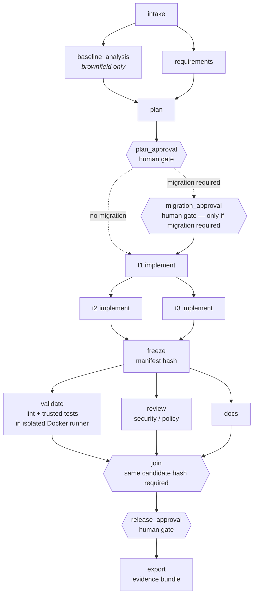
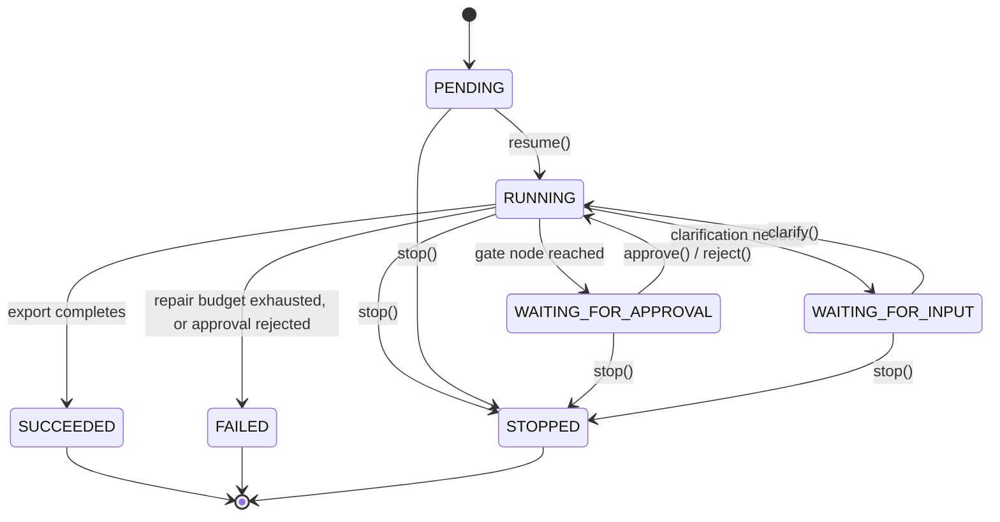
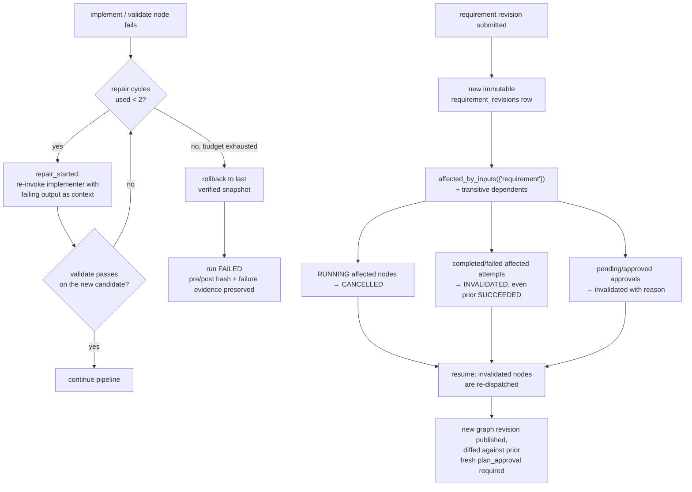

# ForgeFlow architecture

## Components

```
coordinator/     graph, durable state, policy, workspace, adapters, isolated runner, scheduler, metrics, export
prompts/         system prompts for the five logical roles
schemas/         strict JSON schemas the model output is validated against (generated by coordinator/roles.py)
ui/templates/    minimal server-rendered HTML for the local UI
scenarios/       three scenario fixtures + the target application's contract, split into additive parts
trusted_tests/   evaluator-owned acceptance tests, mounted read-only into the worker container
tests/           coordinator's own unit/integration tests
fixtures/        deterministic role outputs + reference shortener implementations for offline runs
docker/          the pinned worker image the isolated runner uses
runs/<run-id>/   per-run baseline/candidate workspaces, artifacts, validation logs, snapshots, export/
```

The **control plane** (`coordinator/`) and the **generated target application** (a run's `candidate/`
workspace) are strictly separate. Generated code can only write under `app/` and `tests/` inside its own
disposable workspace; it can never see or edit `coordinator/`, `trusted_tests/`, `prompts/`, `schemas/`, or
another run's files. See `coordinator/policy.py`.

## Orchestration graph

Gates (diamonds) are inserted by the coordinator (`coordinator/graph.py::build_standard_graph`), not
proposed by the model — a plan cannot remove one by omitting it. `migration_approval` only exists on the
branch when the plan itself declares `migration.required=true`.



## Control flow

```
UI/CLI -> Coordinator.resume(run_id)
            |
            v
     acquire scheduler lease (SQLite row, TTL) -> reconcile interrupted attempts
            |
            v
     loop: load graph revision, compute node states from latest attempts
           dispatch ready nodes (bounded concurrency) via a thread pool
           an approval node is a synchronous gate: request/check it before dispatching anything else
           each node handler proposes -> coordinator validates -> coordinator acts -> event appended
           on failure: bounded repair (re-issue implement..validate) or rollback to last verified snapshot
     until: WAITING_FOR_INPUT | WAITING_FOR_APPROVAL | SUCCEEDED | FAILED | STOPPED
```

`coordinator/graph.py` defines the node kinds and validates structure (no cycles, no unknown
dependencies, no duplicate ids, required gates present: `plan_approval`, `join`, `release_approval`).
`coordinator/scheduler.py::build_standard_graph` (in `graph.py`) composes the fixed governed pipeline
around the planner's own implementation tasks, so a model cannot remove a gate by omitting it from its
plan — the gates are inserted by the coordinator, not proposed by the model.

## State model (`coordinator/store.py`, SQLite, WAL)

`runs`, `requirement_revisions`, `graph_revisions`, `node_attempts`, `artifacts`, `events`
(hash-chained: `hash = sha256(prev_hash + canonical_json(fields))`), `approvals`, `clarifications`,
`operations` (idempotency guard keyed by an operation id + precondition hash).

Run statuses: `PENDING, RUNNING, WAITING_FOR_INPUT, WAITING_FOR_APPROVAL, SUCCEEDED, FAILED, STOPPED`.
Node statuses: `PENDING, RUNNING, SUCCEEDED, FAILED, BLOCKED, INVALIDATED, CANCELLED, INTERRUPTED`.



A single scheduler owns a run via a leased row (`lease_owner`, `lease_expires`); `resume` first
reconciles any attempt still `RUNNING` (from a scheduler that died) to `INTERRUPTED`, preserving all
already-succeeded artifacts. `export` is idempotent per candidate hash via the `operations` table.

## Failure recovery and replanning decision flow

Two independent decision paths: bounded repair on a failed node (left), and the invalidation cascade on a
mid-flight requirement revision (right, detailed in "Replanning" below).



## Replanning (`Coordinator._revise`)

1. New immutable `requirement_revisions` row with a reason.
2. `TaskGraph.affected_by_inputs({"requirement"})` computes every node that reads the requirement plus its
   transitive dependents (via `TaskGraph.dependents`).
3. Any `RUNNING` affected node is `CANCELLED`; any completed/failed affected node's latest attempt is
   marked `INVALIDATED` — including a previously `SUCCEEDED` one, so stale evidence cannot satisfy a gate.
4. Every pending/approved approval is marked `invalidated` with a reason.
5. On resume, the invalidated nodes are re-dispatched (they are `RERUNNABLE`); a new graph revision is
   published once `plan` reruns, with a diff against the prior revision.
6. A fresh plan approval is required before any further mutation.

## Runtime agents (`coordinator/roles.py`, `prompts/*.md`, `schemas/*.json`)

Five logical roles — analyst, architect, implementer, reviewer, documenter — share one adapter. Each
returns strict JSON (`additionalProperties: false`, all properties required) validated locally
(`jsonschema`) in addition to the provider's own schema-constrained decoding. Model output only
*proposes*: normalized requirements, a task DAG, file edits, review findings, docs. The coordinator is the
only thing that writes to the candidate workspace (`coordinator/workspace.py::apply_edits`, after
`coordinator/policy.py::validate_edits`), runs commands (`coordinator/runner.py`, a fixed allowlist), marks
tests passed, or grants approvals.

## Adapters (`coordinator/adapters/`)

- `OpenAIAdapter` — Chat Completions with strict `json_schema` structured output. Reads
  `OPENAI_API_KEY`/`OPENAI_MODEL` from the coordinator process's own environment only; never logs the key
  (`util.redact` scrubs every event payload); bounded timeout + retries with backoff on transient HTTP
  statuses; one structured-output correction attempt; every response is validated locally before use.
- `FixtureAdapter` — deterministic JSON files under `fixtures/<scenario>/<role>[.<task>][.rev<N>].json`,
  used for engine tests and offline rehearsal. A missing fixture is a hard error, never a silent
  substitution for a failed live call — the two adapters are never mixed within one run
  (`Coordinator._call_model` refuses a response whose `execution_mode` doesn't match the configured
  adapter). `run.mode` and every exported artifact carry `execution_mode` explicitly.

## Isolated runner (`coordinator/runner.py`, `docker/Dockerfile.worker`)

`docker run --network none --user 65534:65534 --cap-drop ALL --security-opt no-new-privileges --read-only
--tmpfs /tmp ...`, candidate mounted read-only at `/work/candidate`, trusted tests mounted read-only at
`/work/trusted_tests`, a fixed command allowlist (`lint`, `test`, `migrate`) — no arbitrary shell string is
ever exposed to a model. The container gets no provider credentials and no Docker socket
(`coordinator/policy.py::worker_env` refuses to pass any `*KEY*`/`*TOKEN*` variable and asserts no
`OPENAI*` variable is present). If Docker is unavailable, `RunnerUnavailable` is raised and execution is
refused — never silently downgraded to unsandboxed subprocess execution.

## Policy engine (`coordinator/policy.py`)

- Candidate paths: reject absolute paths, `..`, backslashes, control characters, unsafe segments, hidden
  or executable-suffixed files; allow only `app/*`, `tests/*`, and a few named root files; symlink escape
  is checked by resolving every existing ancestor (`resolve_inside`).
- Task-level `allowed_paths` (from the *approved* plan) further narrow what a specific implementation task
  may touch.
- Size/count limits from `Budget` (files per edit, bytes per file, total edit bytes).
- A fixed command allowlist; a model can only ask to run `lint`/`test`/`migrate`.
- `scan_untrusted_text` flags instruction-like phrasing in requirement/baseline text (`untrusted_text_flagged`
  event) — it is logged, never obeyed; the system prompt tells the model the same, and
  `tests/test_orchestration_e2e.py::test_untrusted_repository_text_cannot_override_policy` proves the
  coordinator's own enforcement doesn't depend on the model behaving.

## Evidence export (`coordinator/export.py`)

Every run can be exported (idempotently) to `runs/<id>/export/`: `run-summary.md`, requirement/graph
revisions, decisions, approvals, `events.jsonl` (hash-chain verified on export), `candidate.diff`,
artifact manifest, `validation/`, `metrics.json`, and `release/` (the approved candidate + release
manifest, or an explicit `STATUS.txt` saying it was not released). A heuristic secret scan redacts any
file that still contains something that looks like a credential.

## UI/CLI (`coordinator/api.py`, `coordinator/cli.py`, `ui/templates/`)

Server-rendered HTML with a 4-second meta-refresh poll; binds to `127.0.0.1` by default
(`FORGEFLOW_HOST`/`FORGEFLOW_PORT`); every mutating form carries a single-use CSRF token checked against
same-origin. The CLI (`forgeflow ...`, see README) has full parity for every workflow the UI exposes and is
the primary way the three scenarios were rehearsed, since it composes cleanly into a scripted demo.

## Known deviations from an idealized design

- The five roles share one model adapter/process rather than five independent agents; this matches the
  brief's explicit allowance ("no requirement for one process or model per role") and keeps the surface
  small enough to secure and test in one day.
- The "impact map" and "baseline_analysis" symbol extraction is a simple Python `ast` walk, not a full
  static-analysis tool; it is enough to force the planner to cite real paths/symbols and enough for the
  orchestration test that checks it, not a production code-intelligence system.
